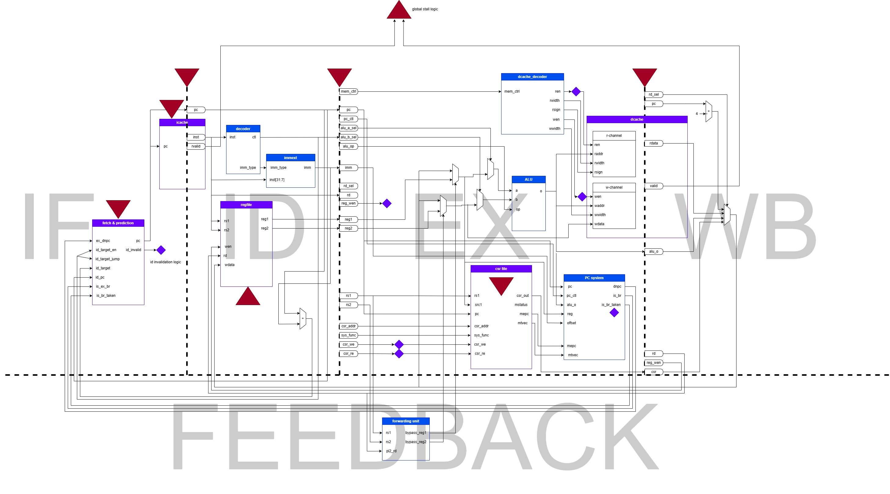
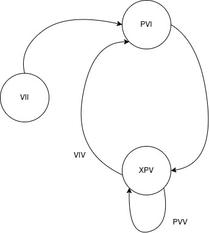

# Speedflow documentation

## overview

### 4-stage pipeline

There are 4 stages in the Speedflow core:

- `IF`, instruction fetch
- `ID`, instruction decode
- `EX`, execution
- `WB` write back

### 2 caches implemented with DPI-C

## BPU

### overview

Branch prediction unit(BPU) of Speedflow is an dynamic branch predictor which uses branch history table(BHT). For clarity, we use term `snpc`(static next pc) for the next pc when branch is not taken, and `target` for the target address when branch is taken, and `dnpc`(dynamic next pc) for the correct next pc. Also, we uses numbers to represent correct instruction flow, i.e. 2 is the `dnpc` of 1

### BPU controller state machine

There is two state machines in the BPU. One is 2-bit saturation counter for predict a pc, and another is work state machine to keep it work in a correct state(BPU controller state machine).

there are 3 work states: 

|     state     |         notation          |   IF   |   ID    |   EX    |
| :-----------: | :-----------------------: | :----: | :-----: | :-----: |
|     `VII`     |    reset/initial state    |   1    | invalid | invalid |
|     `PVI`     | the 1st state after reset | 1.pred |    1    | invalid |
| `XPV` (`PVV`) |  (if `1.pred == 1.dnpc`)  | 2.pred |    2    |    1    |
| `XPV` (`VIV`) |  (if `1.pred != 1.dnpc`)  |   2    | invalid |    1    |

There are 3 states in the state machine of the BPU controller.

- `INIT` state means the BPU state after reset. In this state, BPU's first address is a specific constant, usually `0x00000000` or `0x80000000`. The right initial address will be loaded at next state. The next state is `VI`.
- `PV` means the pipeline state is "predicted, valid", the instruction in `IF` stage is predicted by the instruction(guaranteed correct) in `ID` stage. The next state may either be `VI` or `PV` due to the correctness of prediction.
- `VI` means the pipeline state is "valid, invalid", the instruction in `IF` stage is correct, either guaranteed by initial loading or branch correction mechanism. The next state is `PV`.

Note that invalid instructions are different from `NOP`, invalid instructions act as `NOP` but have extra tag to inform predictor that the `dnpc` of this instruction is disabled.

The correct `dnpc` will be calculated in the EX stage, we can get the combinational outcome before the next clock signal comes. In this scenario, we bypass/forward the pc into the `IF` stage to get earlier `dnpc`. So in the stage diagram, once the correct instruction in `ID` stage(`PV` state) be sent into `EX` stage, the correct address can be calculated, either send to the `IF` stage when `EX.dnpc!=ID.pc` and transfer the state into `VI` state, or validate the correctness of `ID.pc` when `EX.dnpc==ID.pc`, and keep the current `PV` state. 

Ohno I found a bug in the 

### IO ports

|     IO port      |                           function                           |
| :--------------: | :----------------------------------------------------------: |
|     `id_pc`      |                  the pc value of `ID` stage                  |
|    `ex_dnpc`     |              the correct next pc of `EX` stage               |
|  `id_target_en`  |           enable the target next pc of `ID` stage            |
| `id_target_jump` | the instruction in `ID` stage is a unconditional jump (except `jalr`) |
|   `id_target`    |               the target next pc of `ID` stage               |
|    `is_ex_br`    |       the `EX` stage is executing a branch instruction       |
|  `is_br_taken`   | (enable when `is_ex_br == 1`) the branch executing in `EX` stage is taken |

#### controller

BPU controller should listen to the pc value of `ID` stage(`id_pc`), and the `dnpc` value of `EX` stage. It also need a signal to tell it whether the instruction in the `ID` stage is a branch(or jump)(`id_target_en` and `id_target_jump`), and the target address of the branch(or jump) should be calculated and passed to BPU.

#### predictor

For the BPU predictor, it need to know whether there is a branch and whether the branch is taken, to record BHT. Given that the correct `dnpc` is on `EX` stage, predictor need a `is_ex_br` signal and a `is_br_taken` signal to enable saturation counter. And there need a bit output for whether the branch is taken, and controller select the predicted pc value to output. There will be also a indicator that some instruction should be invalidated, so we name it `id_invalid`.

### Implementation

Speedflow uses a MUX for pc output selection among `id_ppc`(predicted pc next to `ID` stage), `init_pc` and `ex_dnpc`(the correct pc calculated by `EX` stage) . Note that `jalr` instruction's `dnpc` cannot calculated in `ID` stage, so this instruction would make `id_target_en` be `0`.

### Corner cases

#### `jalr` instruction

The target address of `jalr` can only be calculated in the `EX` stage, so we don't make effort for it, and the correction mechanism of BPU will automatically make the control flow correct.  

#### exceptions

## ALU

## Cache

## pipeline stall mechanism

To ensure the pipeline can pause the flow when icache miss or dcache miss, we need a stall mechanism to do that thing. In Speedflow, I added `pipeline_en` signal to every sequential logic modules, which enables the state update. When cache miss happens, cache module should pull down `valid` signal down to `0`, and causes `pipeline_en` to `0`. When cache complete the data process, it will pull up the `valid` signal and the `pipeline_en` become to `1`. 

There should be a mechanism to ensure that the cache who raises the pipeline stall will perform correctly under `pipeline_en == 0` , otherwise there will form a deadlock.
